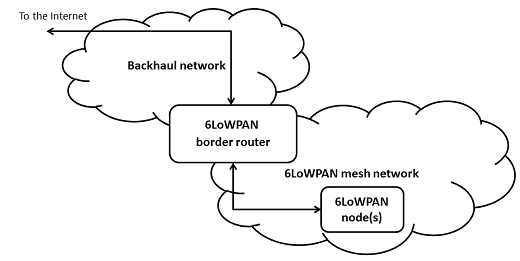
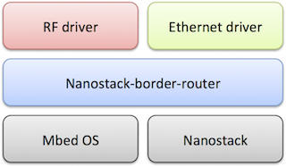

# Nanostack Border Router

Nanostack Border Router is a generic Mbed border router implementation that provides the 6LoWPAN ND or Wi-SUN border router initialization logic.

A border router is a network gateway between a wireless 6LoWPAN mesh network and a backhaul network. It controls and relays traffic between the two networks. In a typical setup, a 6LoWPAN border router is connected to another router in the backhaul network (over Ethernet, Cellular or a serial line) which in turn forwards traffic to and from the internet or a private company LAN, for instance.



## Structure

This application runs on Mbed OS and uses PHY drivers and Nanostack to form a border router.



The code layout is organized like this:

```
configs/                  Contains example configuration files
drivers/                  Contains PHY drivers
mbed-os/                  Contains Mbed OS, itself
source/                   Contains the application code
mbed_app.json             Build time configuration file
```

## Building

1. Clone this repository.
1. Run `mbed deploy`.
1. Add connectivity driver, if not provided by Mbed OS.
1. Select target platform.
1. Select toolchain.
1. Configure.
1. Build.

For example:

```
$ mbed deploy

$ mbed target K64F
 OR
$ mbed target NUCLEO_F429ZI

$ mbed toolchain GCC_ARM

$ mbed compile
```

### Adding connectivity driver

This application requires the 802.15.4 RF driver to be provided for the networking stack. The driver can be either external, or provided by Mbed OS.

You can add an external driver by calling:

```
mbed add <driver>
```

For example, STM Spirit1 RF driver is added by calling `mbed add stm-spirit1-rf-driver`

## Selecting the target platform

The target platform is the hardware on which the border router runs. There are target platforms already available in Mbed OS.

To write your own target, follow the instructions in [Adding target support to Mbed OS 5](https://os.mbed.com/docs/mbed-os/latest/porting/porting-targets.html).

The border router requires an RF driver to be provided for Nanostack. Currently, there are the following drivers available in the Mbed OS:

* [Atmel AT86RF233](https://github.com/ARMmbed/atmel-rf-driver).
* [Atmel AT86RF212B](https://github.com/ARMmbed/atmel-rf-driver).
* [NXP MCR20A](https://github.com/ARMmbed/mcr20a-rf-driver).
* [STM-s2lp](https://github.com/ARMmbed/mbed-os/tree/master/components/802.15.4_RF).

Following external driver can be added as described [above](#adding-connectivity-driver):

* [STM Spirit1](https://github.com/ARMmbed/stm-spirit1-rf-driver).

The backhaul is either SLIP, Ethernet or Cellular. For Ethernet either an Mbed OS "EMAC" driver can be used, or a native Nanostack driver. Currently, native Nanostack drivers exists for the following backhauls:

* [K64F Ethernet](https://github.com/ARMmbed/sal-nanostack-driver-k64f-eth).
* [SLIP driver](https://github.com/ARMmbed/sal-stack-nanostack-slip).

The existing drivers are in the `drivers/` folder. More drivers can be linked in.

See [Notes on different hardware](https://github.com/ARMmbed/mbed-os-example-mesh-minimal/blob/master/Hardware.md) to see known combinations that work.

## Configuring Nanostack Border Router

Applications using Nanostack Border Router need to use a `.json` file for the configuration. You can find the example configurations in the `configs/` folder.

### The backhaul configuration options

| Field                               | Description                                                   |
|-------------------------------------|---------------------------------------------------------------|
| `backhaul-dynamic-bootstrap`          | Defines whether the manually configured backhaul prefix and default route are used, or whether they are learnt automatically via the IPv6 neighbor discovery. False means static and true means automatic configuration. |
| `backhaul-prefix`                     | The IPv6 prefix (64 bits) assigned to and advertised on the backhaul interface. Example format: `fd00:1:2::` |
| `backhaul-default-route`              | The default route (prefix and prefix length) where packets should be forwarded on the backhaul device, default: `::/0`. Example format: `fd00:a1::/10` |
| `backhaul-next-hop`                   | The next-hop value for the backhaul default route; should be a link-local address of a neighboring router, default: empty (on-link prefix). Example format: `fe80::1` |
| `backhaul-mld`                        | Enable sending Multicast Listener Discovery reports to backhaul network when a new multicast listener is registered in mesh network. Values: true or false |

### 6LoWPAN ND border router options

| Field                               | Description                                                   |
|-------------------------------------|---------------------------------------------------------------|
| `security-mode`                       | The 6LoWPAN mesh network traffic (link layer) can be protected with the Private Shared Key (PSK) security mode, allowed values: `NONE` and `PSK`. |
| `psk-key`                             | A 16-bytes long private shared key to be used when the security mode is PSK. Example format (hexadecimal byte values separated by commas inside brackets): `{0x00, ..., 0x0f}` |
| `multicast-addr`                      | Multicast forwarding is supported by default. This defines the multicast address to which the border router application forwards multicast packets (on the backhaul and RF interface). Example format: `ff05::5` |
|`ra-router-lifetime`|Defines the router advertisement interval in seconds (default 1024 if left out).|
|`beacon-protocol-id`|Is used to identify beacons. This should not be changed (default 4 if left out).|

To learn more about 6LoWPAN and the configuration parameters, please read the [6LoWPAN overview](https://os.mbed.com/docs/latest/reference/mesh-tech.html).

See [configs/6lowpan_Atmel_RF.json](configs/6lowpan_Atmel_RF.json) for an example configuration file.

#### The routing protocol RPL (6LoWPAN ND)

Nanostack Border Router uses [RPL](https://tools.ietf.org/html/rfc6550) as the routing protocol on the mesh network side (RF interface) when in 6LoWPAN-ND mode. Currently, only the `grounded/non-storing` operation mode is supported.

Nanostack Border Router offers the following configuration options for RPL:

| Field                               | Description                                                   |
|-------------------------------------|---------------------------------------------------------------|
| rpl-instance-id                     | The RPL instance ID value that identifies the RPL instance, default: 1 |
| rpl-idoublings                      | RPL Trickle parameter: DIOIntervalDoublings value, default: 12 |
| rpl-imin                            | RPL Trickle parameter: DIOIntervalMin value, default: 9 |
| rpl-k                               | RPL Trickle parameter: the redundacy constant k, default: 10 |
| rpl-max-rank-inc                    | Maximum rank increase value, default: 2048|
| rpl-min-hop-rank-inc                | Minimum rank increase value, default: 128 |
| rpl-default-lifetime                | Default lifetime for the RPL routes, default: 64 |
| rpl-lifetime-unit                   | The value of the unit that describes the lifetime (in seconds), default: 60 |
| rpl-pcs                             | The number of bits that may be allocated to the path control field. |
| rpl-ocp                             | The Objective Function (OF) to use, values: 1=OF0 (default), 2=MRHOF |

### Wi-SUN configuration

The Wi-SUN specific parameters are listed below.

| Field                               | Description                                                   |
|-------------------------------------|---------------------------------------------------------------|
| `network-name`                      | Network name for Wi-SUN the network, MUST be same for all the devices in the network |
| `regulatory-domain`                 | Defines regulatory domain, refer to [ws_management_api](https://github.com/ARMmbed/mbed-os/blob/master/features/nanostack/sal-stack-nanostack/nanostack/ws_management_api.h) for correct values for your region. |
| `operating-class`                   | Defines operating class, limited by the regulatory domain |
| `operating-mode`                    | Defines the operating mode, limited by the regulatory domain |
| `uc-channel-function`               | Unicast channel function |
| `bc-channel-function`               | Broadcast channel function |
| `uc-fixed-channel`                  | Fixed channel for unicast |
| `bc-fixed-channel`                  | Fixed channel for broadcast |
| `uc-dwell-interval`                 | Unicast dwell interval. Range: 15-255 milliseconds |
| `bc-interval`                       | Broadcast interval. Duration between broadcast dwell intervals. Range: 0-16777216 milliseconds |
| `bc-dwell-interval`                 | Broadcast dwell interval. Range: 15-255 milliseconds |
| `certificate-header`                | Wi-SUN certificate header file |
| `root-certificate`                  | Root certificate |
| `own-certificate`                   | Own certificate |
| `own-certificate-key`               | Own certificate's key |

Regulatory domain, operating class and operating mode are defined in the Wi-SUN PHY-specification.

<span class="notes">**Note:** The configuration examples are for testing purposes only; do not use them for production or expose them.</span>

#### Backhaul connectivity

The Nanostack border router application can be connected to a backhaul network. This enables you to connect the devices in a 6LoWPAN mesh network to the internet or a private LAN. The application supports SLIP (IPv6 encapsulation over a serial line), Ethernet and Cellular backhaul connectivity:

```
"config": {
    "backhaul-driver": {
        "help": "options are ETH, SLIP, EMAC, CELL",
        "value": "EMAC"
    },
    "backhaul-mac-src": {
        "help": "Where to get EUI48 address. Options are BOARD, CONFIG",
        "value": "BOARD"
    },
    "backhaul-mac": "{0x02, 0x00, 0x00, 0x00, 0x00, 0x01}",
    "backhaul-dynamic-bootstrap": true,
    "backhaul-prefix": "\"fd00:300::\"",
    "backhaul-next-hop": "\"fe80::1\"",
    "backhaul-default-route": "\"::/0\"",
    .............
}
```

You can select your preferred option through the configuration file (field `backhaul-driver` in the `config` section). The value `SLIP` includes the SLIP driver, and the value `ETH` compiles the border router application with Nanostack native Ethernet backhaul support. `EMAC` uses the board's default Mbed OS network driver, which must be EMAC-based (derived from EMACInterface). `CELL` uses the boards's default Mbed OS cellular device or external cellular device that is configured to provide the default cellular device.

You can define the MAC address on the backhaul interface manually (field `backhaul-mac-src` value `CONFIG`). Alternatively, you can use the MAC address provided by the development board (field `backhaul-mac-src` value `BOARD`). By default, the backhaul driver is set to `EMAC` and the MAC address source is `BOARD`.

You can also set the backhaul bootstrap mode (field `backhaul-dynamic-bootstrap`). By default, the bootstrap mode is set to true, which means the autonomous mode. With the autonomous mode, the border router learns the prefix information automatically from an IPv6 gateway in the Ethernet/SLIP segment. When the parameter is set to false, it enables you to set up a manual configuration of `backhaul-prefix` and `backhaul-default-route`.

If you use the static bootstrap mode, you need to configure a default route on the backhaul interface to properly forward packets between the backhaul and the 6LoWPAN mesh network. In addition to this, you need to set a backhaul prefix. The static mode creates a site-local IPv6 network from which packets cannot be routed outside.

When using the autonomous mode in the 6LoWPAN ND configuration, you can set the `prefix-from-backhaul` option to `true` to use the same backhaul prefix on the mesh network side as well. This allows the mesh nodes to be directly connectable from the outside of the mesh network.

For `CELL` backhaul, no configuration options for addresses are provided. Cellular backhaul device works always in autonomous mode and the border router learns the IPv6 prefix information from the cellular access.

#### Note on the SLIP backhaul driver

If you are using a K64F board, use the UART1 serial line of the board with the SLIP driver. See the `pins` section in the [mbed_app.json](./mbed_app.json) configuration file. To use a different UART line, replace the `SERIAL_TX` and `SERIAL_RX` values with correct TX/RX pin names.

To use the hardware flow control, set the configuration field `slip_hw_flow_control` to true. By default, it is set to false. Before using hardware flow control, make sure the other end of your SLIP interface can handle the flow control.

For the pin names of your desired UART line, refer to your development board's documentation.

An example configuration for the SLIP driver:

```
"target_overrides": {
    "K64F": {
        "SERIAL_TX": "PTE0",
        "SERIAL_RX": "PTE1",
        "SERIAL_CTS": "PTE2",
        "SERIAL_RTS": "PTE3"
    }
```

#### Note on EMAC backhaul

When `backhaul_driver` is set to `EMAC`, the border router uses the target's default network driver, as supplied by `NetworkInterface::get_default_instance`. This must be EMAC-based, derived from EMACInterface. If it is the same driver that a default-constructed `EthernetInterface` would use, so in principle it should work on any board where `EthernetInterface` works.

To use a different interface, change the setting of `target.default-network-interface-type` in `mbed_app.json` to point to a different interface type, or add an overriding definition of `NetworkInterface::get_default_instance` to the application - this overrides any default supplied by the target board.

To use Wi-Fi or other more complex EMAC drivers, necessary configuration parameters must be supplied, either using `mbed_app.json` or configuration in the `NetworkInterface::get_default_instance` override. Also, the driver must follow the guidelines of `EMACInterface` - the border router does not call the `EMACInterface`'s `connect` method, so the driver must work with only a `powerup` call to the `EMAC`.

#### Note on CELL backhaul

When `backhaul_driver` is set to `CELL`, the border router will use the target's default cellular device, as supplied by `CellularInterface::get_default_instance`. Cellular device must support IPv6 PPP connection mode. Board must supply the default Mbed OS cellular device or there must be an external cellular device that is configured to provide default cellular device to Mbed OS.

### Switching the RF shield

By default, the application uses an Atmel AT86RF233/212B RF driver. You can alternatively use any RF driver provided in the `drivers/` folder or link in your own driver. You can set the configuration for the RF driver in the `json` file.

To select the Atmel radio shield, use:

```
        "radio-type":{
            "help": "options are ATMEL, MCR20, SPIRIT1, S2LP",
            "value": "ATMEL"
        },
```

To select the NXP radio shield, use:

```
        "radio-type":{
            "help": "options are ATMEL, MCR20, SPIRIT1, S2LP",
            "value": "MCR20"
        },
```

To select the STM Spirit1 radio shield, use:

```
        "radio-type":{
            "help": "options are ATMEL, MCR20, SPIRIT1, S2LP",
            "value": "SPIRIT1"
        },
```

To select the STM S2LP radio shield, use:

```
        "radio-type":{
            "help": "options are ATMEL, MCR20, SPIRIT1, S2LP",
            "value": "S2LP"
        },
```

If you have chosen the STM Spirit1 Sub-1 GHz RF expansion board [X-NUCLEO-IDS01A4](https://github.com/ARMmbed/stm-spirit1-rf-driver), you need to configure its MAC address in the `mbed_app.json` file. For example:

```json
    "target_overrides": {
        "*": {
            "spirit1.mac-address": "{0xf0, 0xf1, 0xf2, 0xf3, 0xf4, 0xf5, 0xf6, 0xf7}"
        },
    }
```

<span class="notes">**Note**: This MAC address must be unique within the 6LoWPAN mesh network.</span>

After changing the radio shield, recompile the application.

#### Wi-SUN RF shield

Currently, only one radio shield, the STM S2LP radio shield, supports Wi-SUN.


### Wi-SUN test configurations

You can set the Border Router to fixed-channel mode by setting the channel function to fixed-channel, by defining the channel number and by setting the broadcast intervals:

```
        "uc-channel-function": 0,
        "bc-channel-function": 0, 
        "uc-fixed-channel": 11,
        "bc-fixed-channel": 11,
        "bc-dwell-interval": 255,
        "bc-interval": 1020,
```

You can set the EAPOL group transient key (GTK) to a predefined value by setting the GTK0:

```
        "GTK0": "{0xBB, 0x06, 0x08, 0x57, 0x2C, 0xE1, 0x4D, 0x7B, 0xA2, 0xD1, 0x55, 0x49, 0x9C, 0xC8, 0x51, 0x9B}",
```

For the predefined GTK, the Wireshark IEEE 802.15.4 network decryption key can be calculated using SHA-256('Network name' || GTK0).

## File system support

The application can use the file system as instructed in [Mbed OS storage documentation](https://os.mbed.com/docs/latest/reference/storage.html). The file system is not enabled by default due to a variety of possible configurations.

File system activation happens by telling the file system the root path to Nanostack. To set the root path, use the function:

`ns_file_system_set_root_path(root-path)`

After you have set the root path, Wi-SUN stack reads the configuration settings from the file system. Wi-SUN stack writes the configuration back to the file system after the configuration changes.

## Running the border router application

1. Find the  binary file `nanostack-border-router.bin` in the `BUILD` folder.
2. Copy the binary to the USB mass storage root of the development board. It is automatically flashed to the target MCU. When the flashing is complete, the board restarts itself. Press the **Reset** button of the development board if it does not restart automatically.
3. The program begins execution.
4. Open the [serial connection](#serial-connection-settings), for example PuTTY.

## Serial connection settings

Serial connection settings for the Nanorouter are as follows:

* Baud-rate = 115200.
* Data bits = 8.
* Stop bits = 1.

If there is no input from the serial terminal, press the **Reset** button of the development board.

In the PuTTY main screen, save the session, and click **Open**. This opens a console window showing debug messages from the application. If the console screen is blank, you may need to press the **Reset** button of the board to see the debug information. The serial output from the 6LoWPAN border router looks something like this in the console:

```
[INFO][app ]: Starting Nanostack border router...
[INFO][brro]: NET_IPV6_BOOTSTRAP_AUTONOMOUS
[INFO][app ]: Using ETH backhaul driver...
[INFO][Eth ]: Ethernet cable is connected.
[INFO][addr]: Tentative Address added to IF 1: fe80::ac41:dcff:fe37:72c4
[INFO][addr]: DAD passed on IF 1: fe80::ac41:dcff:fe37:72c4
[INFO][addr]: Tentative Address added to IF 1: 2001:999:21:9ce:ac41:dcff:fe37:72c4
[INFO][addr]: DAD passed on IF 1: 2001:999:21:9ce:ac41:dcff:fe37:72c4
[INFO][brro]: Backhaul bootstrap ready, IPv6 = 2001:999:21:9ce:ac41:dcff:fe37:72c4
[INFO][brro]: Backhaul interface addresses:
[INFO][brro]:    [0] fe80::ac41:dcff:fe37:72c4
[INFO][brro]:    [1] 2001:999:21:9ce:ac41:dcff:fe37:72c4
[INFO][addr]: Address added to IF 0: fe80::ff:fe00:face
[INFO][br  ]: BR nwk base ready for start
[INFO][br  ]: Refresh Contexts
[INFO][br  ]: Refresh Prefixs
[INFO][addr]: Address added to IF 0: 2001:999:21:9ce:0:ff:fe00:face
[INFO][addr]: Address added to IF 0: fe80::fec2:3d00:4:a0cd
[INFO][brro]: RF bootstrap ready, IPv6 = 2001:999:21:9ce:0:ff:fe00:face
[INFO][brro]: RF interface addresses:
[INFO][brro]:    [0] fe80::ff:fe00:face
[INFO][brro]:    [1] fe80::fec2:3d00:4:a0cd
[INFO][brro]:    [2] 2001:999:21:9ce:0:ff:fe00:face
[INFO][brro]: 6LoWPAN Border Router Bootstrap Complete.
```

## License and contributions

The software is provided under Apache-2.0 license. Contributions to this project are accepted under the same license. Please see [contributing.md](CONTRIBUTING.md) for more info.

This project contains code from other projects. The original license text is included in those source files. They must comply with our license guide.
